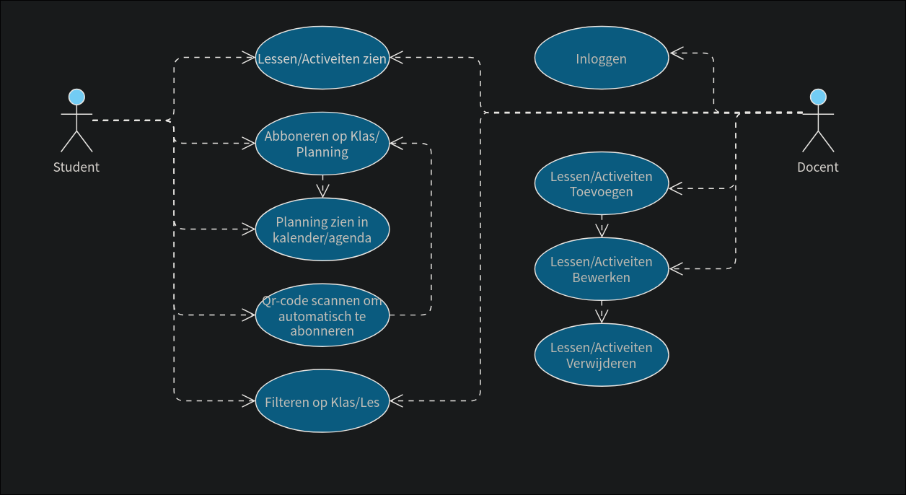

# Functioneel Ontwerp
19-08-2026

## Inleiding 
Dit document beschrijft het functioneel ontwerp van een Webapplicatie voor het "Planning Dashboard Project". De webaplicatie laat verschillende lesplanningen zien van meerdere klassen. 
Waar een student/gebruiker zich kan abonneren op een of meerdere klas(en). 
Docenten kunnen zich aanmelden op een login pagina waar zij activiteiten kunnen aanmaken, aanpassen en op inactief zetten.
Wanneer een student zich abonneert op een planning/klas zal de planning ook in zijn/haar calender komen.

De planning zal zich ook afspelen op het scherm in de hal (C afdeling / leerplein).

## Situatiebeschrijving
### Huidige Situatie
Momenteel staat het scherm op het leerplein (leerplein hangt in de C afdeling) uit en is er geen manier om het lesrooster in je eigen calender/agenda te krijgen.
Docenten kunnen nu dus ook niet een les toevoegen sinds er nog geen omgeving is gemaakt. De les rooster is nu alleen te zien in eduarte.

### Gewenste Situatie
Het lesrooster staat actief op het scherm (leerplein), waar studenten snel kunnen zien waar ze les hebben. Ook zullen studenten gemakkelijk het rooster kunnen zien op hun apparaat, zij kunnen ook abonneren op een klas/planning en dit te zien krijgen in hun eigen calender/agenda app. 
Docenten kunnen gemakkelijk inloggen en een les of activiteit toevoegen of bewerken.
Een superbeheerder kan gemakkelijk docenten toevoegen.

## Requirements
### User Requirements
- Studenten
    Kunnen abonneren op een klas/planning. 
    Kunnen alle lessen en activiteiten zien.
    Filteren op klas/les.
    Qr-code scannen om automatisch te abonneren.

- Docenten
    Inlog omgeving
    Account aanpassen
    Lessen/activiteiten toevoegen 
    Lessen/activiteiten aanpassen
    Lessen/activiteiten inactief zetten

- Superbeheerder
    Inlog omgeving
    Docenten account toevoegen
    Docenten account aanpassen
    Docenten account verwijderen

## Functionele Requirements
### Use-Case Diagram

### Use Case Scenarios

| Naam | Bekijkt activiteiten |
| :--- | :--- |
| **Versie** | 1.0 |
| **Actor** | Student, Docent |
| **Preconditie** | De webapplicatie is bereikbaar via de browser of het fysieke scherm op het leerplein (C-afdeling) staat aan. |
| **Scenario** | Gebruiker opent het dashboard via telefoon/laptop of bekijkt het fysieke scherm. Het lesrooster wordt getoond in Schiphol-stijl (Bestemming/Les, VluchtNummer/Klas, Airline/Docent, Gate/Lokaal, Tijd/Tijdstip). |
| **Uitzonderingen** | Niks staat in de planning: Het scherm toont geen activiteiten. |
| **Niet-functionele eisen** | Database response binnen 2 seconden. |
| **Postconditie** | De gebruiker heeft een up-to-date en overzichtelijk beeld van de actuele lessen en activiteiten. |

| Naam | Logt in |
| :--- | :--- |
| **Versie** | 1.0 |
| **Actor** | Docent, Superbeheerder |
| **Preconditie** | Gebruiker beschikt over een aangemaakt account en bevindt zich op de inlogomgeving. |
| **Scenario** | 1. Gebruiker vult e-mailadres en wachtwoord in. Gebruiker klikt op de inlogknop. Bij akkoord wordt de gebruiker doorverwezen naar de beheeromgeving. |
| **Uitzonderingen** | Onjuiste inloggegevens: Wordt toegang geweigerd en toont een foutmelding. |
| **Niet-functionele eisen** | Snelheid van de response ligt onder 1 seconde. |
| **Postconditie** | Gebruiker is geauthenticeerd en heeft toegang tot zijn/haar specifieke beheerfuncties. |

| Naam | Maakt activiteit aan |
| :--- | :--- |
| **Versie** | 1.0 |
| **Actor** | Docent |
| **Preconditie** | Docent is succesvol ingelogd in de beheeromgeving. |
| **Scenario** | Docent opent het formulier voor een nieuwe activiteit. Vult de vereiste velden in (Bestemming(Les), VluchtNummer(Klas), Airline(Docent), Gate(Lokaal), Tijd). Verzendt het formulier. De invoer wordt gevailideert en de gegevens worden opgeslagen. De activieteit wordt dan rechtstreeks doorgespeeld naar wat studenten kunnen zien. |
| **Uitzonderingen** | Ongeldige tijd of ontbrekende verplichte velden: Geeft een validatiefout en de data wordt niet opgeslagen. |
| **Niet-functionele eisen** | Realtime updates. |
| **Postconditie** | De activiteit is toegevoegd aan de database en direct zichtbaar op alle dashboards. |

| Naam | Past activiteit aan |
| :--- | :--- |
| **Versie** | 1.0 |
| **Actor** | Docent |
| **Preconditie** | Docent is ingelogd en de betreffende activiteit bestaat in het systeem. |
| **Scenario** | Docent selecteert een activiteit in de beheeromgeving. Docent wijzigt de gegevens en bevestigd de wijziging door op de knop te drukken. De wijziging word direct doorgespeeld naar de homepagina. |
| **Uitzonderingen** | Gelijktijdig bewerken door een andere docent: Foutmelding dat de actie niet kon worden voltooid. |
| **Niet-functionele eisen** | Verwerkingstijd onder de 1 seconde. |
| **Postconditie** | De activiteit is bijgewerkt. |

| Naam | Zet activiteit op inactief |
| :--- | :--- |
| **Versie** | 1.0 |
| **Actor** | Docent |
| **Preconditie** | Docent is ingelogd en de betreffende activiteit bestaat in het systeem. |
| **Scenario** | Docent selecteert een activiteit in de beheeromgeving. Docent klikt op de knop om op inactief te zetten en bevestigt de actie. Activiteit wordt op inactief gezet. De wijziging word direct doorgespeeld naar de homepagina. |
| **Uitzonderingen** | Activiteit is al inactief gezet door een andere docent: Melding dat de activiteit al op inactief staat. |
| **Niet-functionele eisen** | Directe verwerking (1 seconde). |
| **Postconditie** | De activiteit is op inactief gezet. |

| Naam | Link genereren agenda-feed-link |
| :--- | :--- |
| **Versie** | 1.0 |
| **Actor** | Student |
| **Preconditie** | Student heeft de webapplicatie geopend in een browser. |
| **Scenario** | Student vinkt een of meerdere klassen aan. Student klikt op de knop om een agenda-link te genereren. Krijgt link en kan erop klikken om toe te voegen aan zijn/haar agenda. |
| **Uitzonderingen** | Geen klas geselecteerd: Systeem meld dat er minimaal één klas moet worden aangevinkt. |
| **Niet-functionele eisen** | Geen account vereist. Beveiligd tegen server overload bij veel gelijktijdige requests. |
| **Postconditie** | De student beschikt over een direct te koppelen kalender-link. |

| Naam | Genereert QR-Code |
| :--- | :--- |
| **Versie** | 1.0 |
| **Actor** | Student |
| **Preconditie** | Student heeft de webapplicatie geopend op een browser of mobiel apparaat. |
| **Scenario** | Student selecteert de gewenste klas(sen). Student klikt op de knop 'Genereer QR-code'. Het systeem genereert een QR-code die verwijst naar de specifieke agenda-feed. De QR-code wordt getoond op het scherm om te scannen of te delen. |
| **Uitzonderingen** | Geen klas geselecteerd: Foutmelding dat een selectie verplicht is. |
| **Niet-functionele eisen** | Snel genereren in de frontend via JavaScript. |
| **Postconditie** | De QR-code is zichtbaar en klaar om gescand te worden door de student of klasgenoten. |

| Naam | Scant QR-Code redirect naar link |
| :--- | :--- |
| **Versie** | 1.0 |
| **Actor** | Student |
| **Preconditie** | Een QR-code voor een klas/agenda-feed is aanwezig of gedeeld. |
| **Scenario** | Student scant de QR-code met de camera van zijn/haar mobiele apparaat. Het apparaat opent de ingebouwde browser/kalender-app via de url uit de QR-code. De browser regelt het abonneren in de kalender-app. |
| **Uitzonderingen** | Ongeldige of verlopen QR-code: De mobiele browser toont een foutpagina (404). |
| **Niet-functionele eisen** | Werkt op standaard mobiele camera's en kalender-apps. |
| **Postconditie** | De student is automatisch doorgestuurd en de browser regelt het abonneren. |

| Naam | Filtert op klas |
| :--- | :--- |
| **Versie** | 1.0 |
| **Actor** | Student, Docent |
| **Preconditie** | Gebruiker bevindt zich op het dashboard. |
| **Scenario** | Gebruiker selecteert een klas via de filteropties. Alleen de gekozen klassen blijven zichtbaar. |
| **Uitzonderingen** | Geen matchende klassen: Dashboard toont een lege lijst met melding. |
| **Niet-functionele eisen** | Directe zoekfunctie bij ingevoerde tekst zonder op enter te drukken. |
| **Postconditie** | Het dashboard toont een gefilterde weergave van het rooster. |

| Naam | Zoekt voor bestemming of omschrijving |
| :--- | :--- |
| **Versie** | 1.0 |
| **Actor** | Student, Docent |
| **Preconditie** | Gebruiker bevindt zich op het dashboard. |
| **Scenario** | Gebruiker typt een zoekterm in het zoekveld (bijv. "Workshop" of lokaalnaam). De tabel ververst op enter en toont enkel de matchende resultaten. |
| **Uitzonderingen** | Geen resultaten gevonden: Melding "Geen activiteiten gevonden voor deze zoekopdracht". |
| **Niet-functionele eisen** | Directe reactiviteit in de zoekbalk. Realtime updates. |
| **Postconditie** | De gebruiker ziet alleen de specifieke gezochte lessen/activiteiten. |

| Naam | Maakt klas aan |
| :--- | :--- |
| **Versie** | 1.0 |
| **Actor** | Docent |
| **Preconditie** | Gebruiker is ingelogd in het beheerpaneel. |
| **Scenario** | Gebruiker navigeert naar klasbeheer. Vult een nieuwe klassennaam in. Klikt op opslaan. |
| **Uitzonderingen** | Klas bestaat al: Gebruiker krijgt een foutmelding. |
| **Niet-functionele eisen** | Meerdere klassen in één keer toevoegen. |
| **Postconditie** | De nieuwe klas is beschikbaar in het systeem en kan gekoppeld worden aan activiteiten. |

| Naam | Bekijkt docenten accounts |
| :--- | :--- |
| **Versie** | 1.0 |
| **Actor** | Superbeheerder |
| **Preconditie** | Superbeheerder is succesvol ingelogd. |
| **Scenario** | Superbeheerder navigeert naar het gebruikersoverzicht. Het systeem haalt de lijst met gebruikers met de rol 'docent' op. De accounts worden overzichtelijk op het scherm getoond. |
| **Uitzonderingen** | Geen docentenaccounts gevonden: Toont een lege tabel. |
| **Niet-functionele eisen** | Alleen toegankelijk voor rollen met superbeheerdersaccount. |
| **Postconditie** | De superbeheerder heeft inzicht in alle geregistreerde docentenaccounts. |

| Naam | Maakt docent account aan |
| :--- | :--- |
| **Versie** | 1.0 |
| **Actor** | Superbeheerder |
| **Preconditie** | Superbeheerder is ingelogd. |
| **Scenario** | Superbeheerder opent het formulier 'Nieuwe docent'. Vult gebruikersnaam, e-mail en een tijdelijk wachtwoord in. |
| **Uitzonderingen** | E-mailadres is al in gebruik: Validatiefout blokkeert de actie. |
| **Niet-functionele eisen** | Meerdere accounts in één keer toevoegen. |
| **Postconditie** | Er is een nieuw docentaccount aangemaakt waarmee ingelogd kan worden. |

| Naam | Past docent account aan |
| :--- | :--- |
| **Versie** | 1.0 |
| **Actor** | Superbeheerder |
| **Preconditie** | Superbeheerder is ingelogd en het docentaccount bestaat. |
| **Scenario** | Superbeheerder selecteert een docentaccount uit het overzicht. Wijzigt de gewenste gegevens (bijv. gebruikersnaam of e-mail). Slaat de wijzigingen op. |
| **Uitzonderingen** | Gewijzigde e-mail bestaat al bij een andere gebruiker: Validatiefout. |
| **Niet-functionele eisen** | Meerdere accounts in één keer aanpassen. |
| **Postconditie** | De gegevens van het docentaccount zijn bijgewerkt. |

| Naam | Verwijderd docent account |
| :--- | :--- |
| **Versie** | 1.0 |
| **Actor** | Superbeheerder |
| **Preconditie** | Superbeheerder is ingelogd en het docentaccount bestaat. |
| **Scenario** | Superbeheerder klikt op 'Verwijderen' bij het betreffende docentaccount. Bevestigt de verwijdering in het pop-upvenster. |
| **Uitzonderingen** | Poging tot verwijderen van het eigen superbeheerdersaccount: Systeem weigert de actie. |
| **Niet-functionele eisen** | Beveiligingscontrole op rolrechten voorafgaand aan de delete-query. |
| **Postconditie** | Het docentaccount is definitief verwijderd en de docent kan niet meer inloggen. |

| Naam | Past eigen account aan |
| :--- | :--- |
| **Versie** | 1.0 |
| **Actor** | Docent |
| **Preconditie** | Docent is ingelogd in de beheeromgeving. |
| **Scenario** | Docent navigeert naar instellingen. Wijzigt eigen gegevens zoals gebruikersnaam, email of wachtwoord. Verzendt de wijzigingen. |
| **Uitzonderingen** | Huidig wachtwoord onjuist bij wachtwoordwijziging: Actie wordt geweigerd. |
| **Niet-functionele eisen** | Veilige verwerking van profielgegevens. |
| **Postconditie** | De eigen accountgegevens van de docent zijn succesvol bijgewerkt. |
