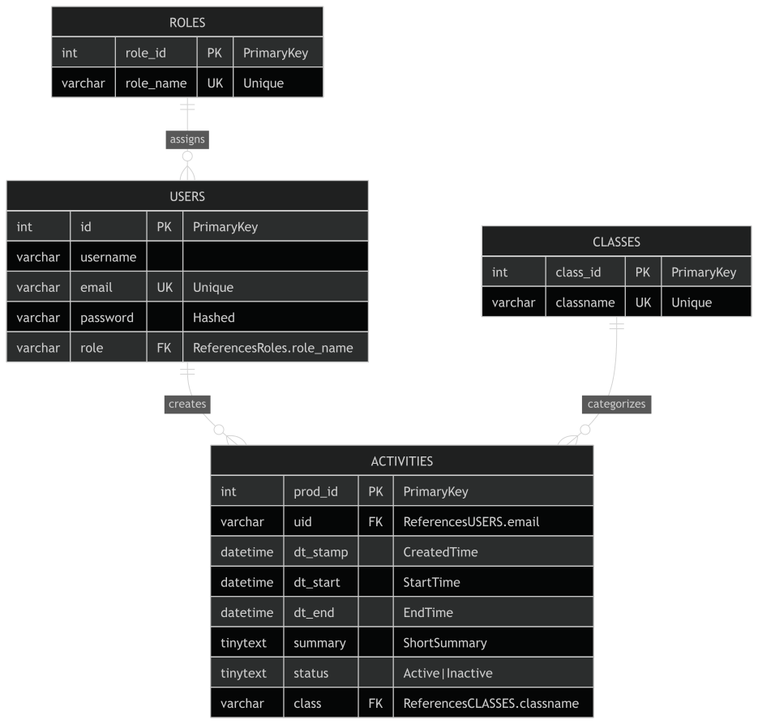
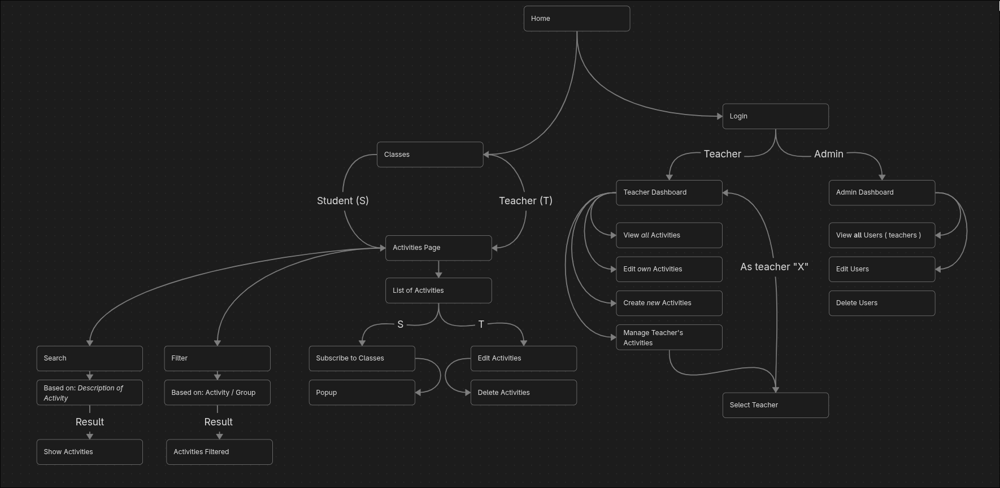

# Technisch Ontwerp
Gemaakt door: Frank, Senna en Tiemen
Datum: 19-08-2026

### Gebruikte technieken 
- Programmeertalen: PHP / HTML / CSS / JavaScript
- Frameworks: Laravel / Vue
- Database: SQLite
- Packages: Carbon (datetime parser) 

# Datamodel
De data wordt opgeslagen in een SQLite database, hieronder zie je de tabel namen. Wij hebben gekozen voor een SQLite database omdat, dit een klein project is en intern wordt gebruikt binnen de IT afdeling van Firda Sneek.
De tabel namen zijn ook geinspireed op de ICS template (zie: 'Link voor ICS template') 

Table: **users**
- id (primary / int)
- username (varchar)
- email (mail *or* varchar)
- password (varchar) // Hashed
- role (varchar) 

Table: **activities**
- prod_id (primary / int)
- uid (mail *or* varchar) -> users.email 
- dt_stamp (datetime) // Created Time | format (YYYYMMDDTHHMMSS)
- dt_start (datetime) // Start Time | format (YYYYMMDDTHHMMSSZ)
- dt_end (datetime) // End Time | format (YYYYMMDDTHHMMSSZ)
- summary (varchar) // Short Summary 
- status (varchar) // Active | Inactive
- location (varchar) 
- class (varchar) -> classes.classname
- version (float) 

Table: **classes**
- class_id (primary / key)
- classname (varchar)

Table: **Roles**
- role_id (primary / key)
- role_name (varchar)

#### Link voor ICS template:
https://www.text-2-ics.com/blog/ics-file-format-structure-guide

## Hoe worden ingevulde gegevens verwerkt?
Ingevulde gegevens worden verwerkt met een bijhorende controller, de controller controleert of alles correct is geschreven denk aan de controle op tijd, hoofdlettergevoeligheid. Vervolgens wordt data gelijk opgeslagen naar de database om te worden bekeken, wijzingen en op inactief te zetten. Ook dit wordt gedaan door een controller. Dit zorgt ervoor dat er geen incorrecte gegevens in de database kunnen komen.

# Algemene zaken

## Toegankelijkheid van gegevens
De normale studenten kunnen alleen activiteiten die zijn ingepland bekijken. Docenten kunnen activiteiten aanpassen en op inactief zetten die zij hebben gemaakt. Dit kan zowel gedaan worden door de docent die de activeit heeft gemaakt en door een ander.

## De responsetijden
De database requests zullen altijd onder de twee secondes zitten, zelfs als het er boven zit zal het niet heel veel uitmaken voor de user experience. Voor docenten zal het waarschijnlijk iets sneller gaan ivm; hoge prioriteit (dus ongeveer een seconde). Ook wordt er gebruik gemaakt van Pusher voor realtime updates tussen de backend en frontend zodat, wijzigingen en toevoegingen direct worden getoond zowel als voor de student en docent. Pusher is handig voor hosting dat geen portforwarding heeft en zit al in de Laravel Starter Kit als broadcasting methode.

## De Onderhoudtbaarheid
Sinds het object georienteerd wordt gemaakt zal alles makkelijk te onderhouden zijn. Alle code moet het liefst apart werken zodat je gemakkelijk code functies en classes kan veranderen. Laravel helpt hier ook bij met controllers, models, migrations en meer.

## Beveiliging van de website
Er moet rekening gehouden met de aangemaakte wachtwoorden, hierdoor zal er gebruik worden gemaakt van een Hash + Salt waardoor het wachtwoord heel moeilijk is om te achterhalen zelfs als iemand toegang heeft tot deze database. Dit is al ingebouwd in de Laravel Starter Kit.

## De ontwikkelmethode / Programmeertalen
Dit project zal worden gemaakt met de framework Laravel met de starter kit "Vue". We hebben gekozen voor deze framework omdat, het makkelijk te onderhouden is, beveiliging al is ingebouwd en automatisch al snel is. Sinds laravel in php is zullen we hier dus php als backend gebruiken. Wij gebruiken "PHP: 8.5", "HTML" , "CSS" , "TailwindCSS" en misschien een beetje "JavaScript" om het iets meer reactive te. Voor Laravel gebruiken wij ook de nieuwste versie. Tijdens dit project maken we ook gebruik van packages om het makkelijker te maken.

## Randvoorwaarden voor koppeling aan de bestaande systemen
Wij gaan github gebruiken als koppelmethode/versiebeheer voor dit project, hier zullen meerdere branches met meerdere features gemaakt worden zodat dit makkelijk opgehaald kan worden. En een goed beeld hebben van de vorige commits/versies.

<!-- ## User Flow Diagram 
 -->
