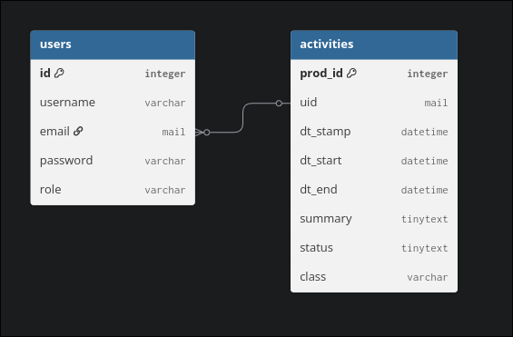

## Technisch Ontwerp
Gemaakt door: Frank, Senna en Tiemen
Datum: 19-08-2026

## Gebruikte technieken 
Programmeertalen: PHP / HTML / CSS / JavaScript
Frameworks: Laravel / Vue
Database: SQLite

## Waar wordt de data opgeslagen?
De data wordt opgeslagen in een SQLite database.

### Link voor ICS template:

## Hoe worden ingevulde gegevens verwerkt?
er wordt gebruikt gemaakt van de laravel authenticator. Ook met het verzenden van forms zou het direct naar de back-end gaan. Vervolgens gelijk opgeslagen naar de database om te worden bekeken door studenten.

## Toegankelijkheid van gegevens
De normale studenten kunnen bestanden alleen bekijken/lezen. 
Docenten kunnen de activiteiten aanpassen die zij hebben gemaakt. Dit wordt gedaan gebaseerd op email.

## De responsetijden
De database requests zullen altijd onder de twee secondes zitten, zelfs als het er boven zit zal het niet heel veel uitmaken voor de user experience. Voor docenten zal het waarschijnlijk iets sneller gaan ivm; hoge prioriteit (dus ongeveer een seconde).  

## De Onderhoudtbaarheid
Sinds het object georienteerd wordt gemaakt zal alles makkelijk te onderhouden zijn.
Alle code moet het liefst apart werken zodat je gemakkelijk code functies en classes kan veranderen.

## Beveiliging van de website

Er moet rekening gehouden met de aangemaakte wachtwoorden, hierdoor zal er gebruik worden gemaakt van een Hash + Salt waardoor het wachtwoord heel moeilijk is om te achterhalen zelfs als iemand toegang heeft tot deze database. Laravel helpt ook veel bij met het valideren van forms sinds laravel al een systeem heeft met een ingebouwde authenticatie manier.

## De ontwikkelmethode / Programmeertalen
Dit project zou worden gemaakt met de framework Laravel met de starterkit "Vue". Sinds laravel in php is zullen we hier dus php als backend gebruiken. Wij gebruiken "PHP: 8.5", "HTML" , "CSS" , "TailwindCSS" en misschien een beetje "JavaScript" om het iets meer reactive te. Voor Laravel gebruiken wij ook de nieuwste versie 12.

## Randvoorwaarden voor koppeling aan de bestaande systemen
Wij gaan github gebruiken als koppelmethode/versiebeheer voor dit project, hier zullen meerdere branches met meerdere features gemaakt worden zodat dit makkelijk opgehaald kan worden. En een goed beeld hebben van de vorige commits/versies
